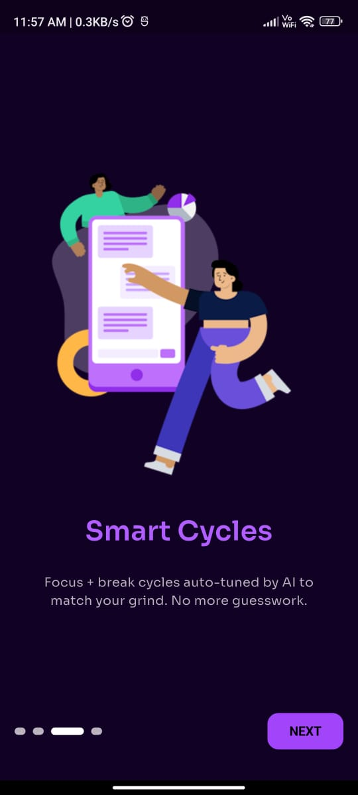
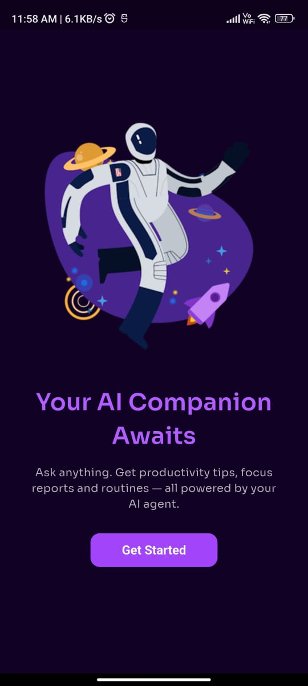
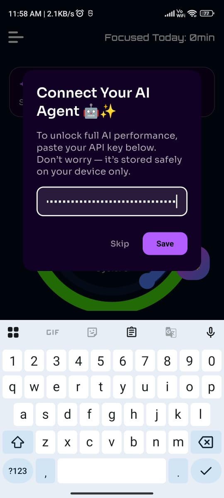
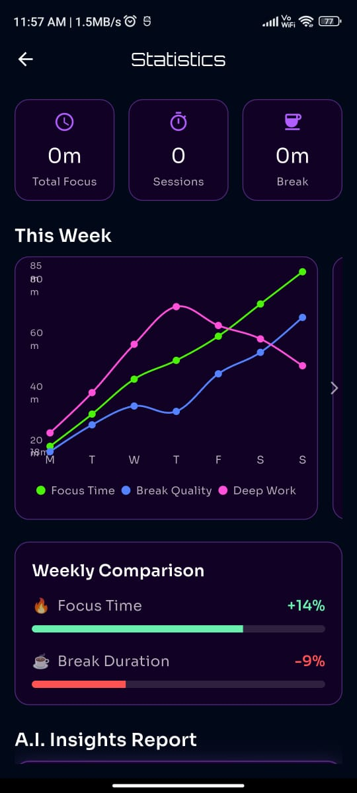
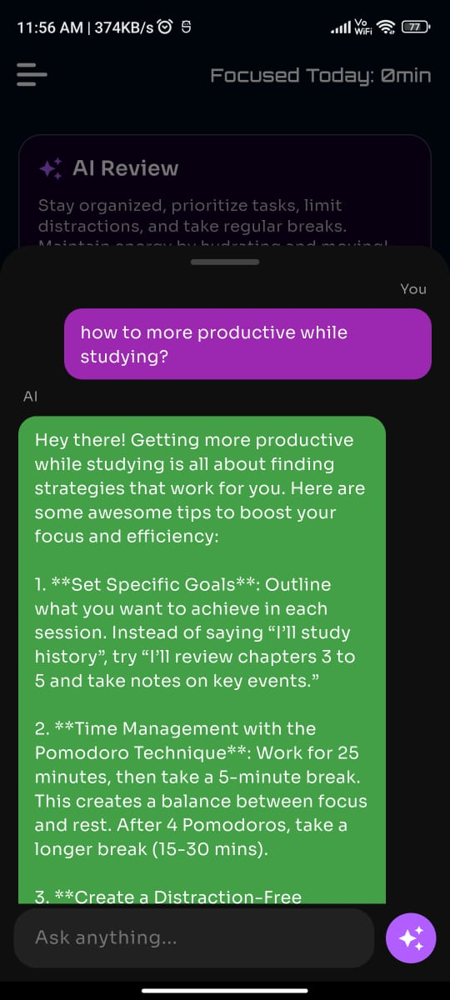

# 🚀 **VFocused: Your AI-Powered Focus Aid**

A productivity app with a **neon cyberpunk theme** that makes focusing _effortless_ instead of stressful.  
VFocused blends **AI intelligence**, **Pomodoro science**, and a **clean modern Flutter UI** to help users build deep focus habits, monitor progress, and unlock personalized productivity insights.

## 🌟 **Why VFocused?**

In a world packed with distractions, VFocused becomes your own **AI-powered productivity partner**.  
It offers daily reviews, personalized focus suggestions, and intelligent cycle tuning — all inside a sleek, futuristic UI.

# 🔥 **Essential Features**

## 🤖 **AI Agent (Powered by OpenAI)**

- Chat with your AI assistant anytime
- Get focus tips, productivity insights, and mindset boosts
- AI analyzes your sessions and recommends improvements
- Optional: Users can add their own API key for _maximum_ AI performance

## ⏱️ **Intelligent Pomodoro Timer**

- Fully customizable focus + break durations
- Neon-themed circular slider
- Tracks focus sessions automatically
- Auto-cycle flow (Focus → Short Break → Long Break)

## 📊 **Advanced Productivity Data**

- Weekly focus analytics
- Shows total focus time, deep-work duration, and break quality
- Clean visual graphs powered by **fl_chart**
- All data stored locally with **Riverpod + Isar**

## 🧠 **AI Daily Review Card**

- AI summarizes your daily productivity
- Highlights strengths + areas to improve
- Auto-updates every time the app launches

## 🎨 **Modern UI/UX**

- Neon cyberpunk color palette
- Smooth animations
- Minimal onboarding with aesthetic visuals
- Custom icons
- Maintains a sharp, Gen-Z-inspired vibe throughout

# 🛠️ **Tech Stack**

### **Frontend**

- Flutter (Dart)
- Riverpod (State Management)
- fl_chart
- sleek_circular_slider
- smooth_page_indicator
- shared_preferences
- Isar Database

### **AI Integration**

- OpenAI Chat Completions API
- Custom system prompts
- Local user API key storage

# ⚙️ **How It Works**

### **1. Onboarding**

- Users complete a smooth landing flow
- They can add their **OpenAI API key** for enhanced AI responses

### **2. Focus Sessions**

- Start Pomodoro cycles
- Track sessions in real time

### **3. AI Integration**

The AI agent:

- Reviews productivity
- Suggests improvements
- Helps build better focus habits

### **4. Statistics Page**

- Displays weekly focus data with clean, interactive charts

## 📸 Screenshots

| Screen 1                | Screen 2                | Screen 3                | Screen 4                |
| ----------------------- | ----------------------- | ----------------------- | ----------------------- |
|  |  |  |  |

| Screen 5                | Screen 6                | Screen 7                | Screen 8                |
| ----------------------- | ----------------------- | ----------------------- | ----------------------- |
|  |  |  |  |

## 🌱 Future Improvements

- 🔁 **Smart Habit Tracking** — detect patterns in your daily routine automatically
- 🧠 **Long-term AI Coaching** — an adaptive coach that learns your behavior over weeks
- ☁️ **Cloud Sync** — access your focus stats across all devices
- 💻 **Web App Version** — full browser support for cross-platform productivity
- 🔥 **Gamified Focus Streaks** — earn levels, badges, and XP for consistent focus

## 📌 About the Project

VFocused was built with one goal:  
to make focus **enjoyable**, **futuristic**, and **frictionless**.

It was created for the **Start Developer Competition Hackathon**, showcasing a blend of AI assistance, clean UI, and productivity science.

## 👨‍💻 Developer

**Aditya** — a student and Flutter developer passionate about building apps that merge  
practical functionality with sleek, modern UI vibes.

Always exploring new ideas, blending tech with creativity, and pushing what a solo dev can build. 🚀
